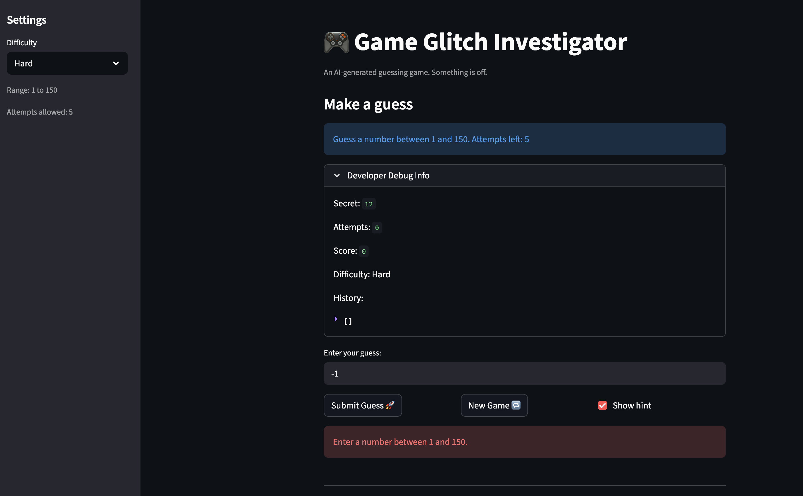
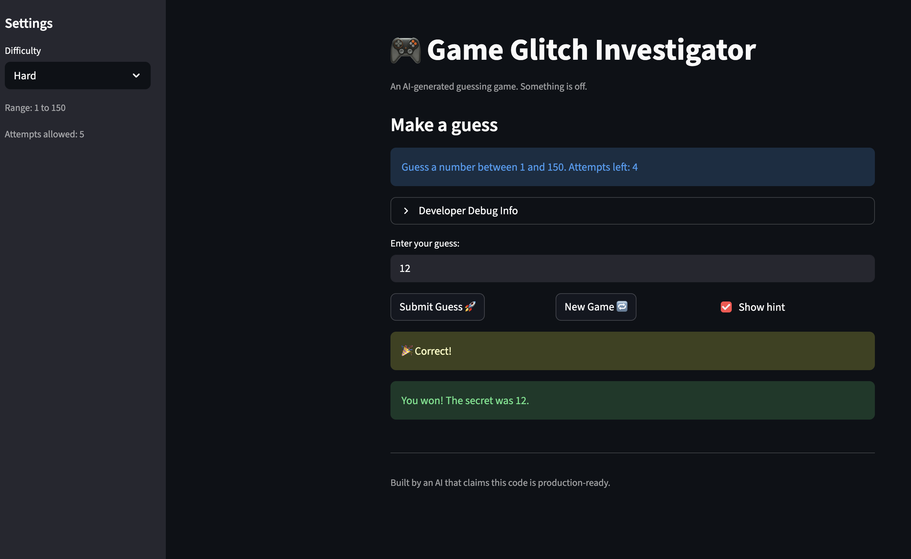
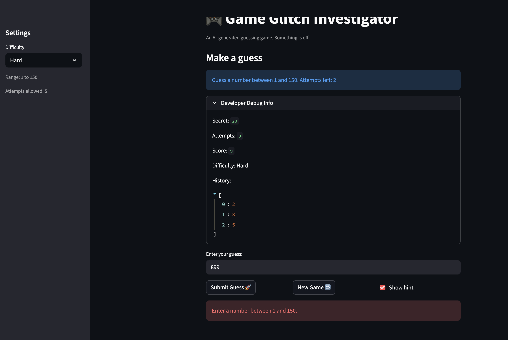

# 🎮 Game Glitch Investigator: The Impossible Guesser

## 🚨 The Situation

You asked an AI to build a simple "Number Guessing Game" using Streamlit.
It wrote the code, ran away, and now the game is unplayable. 

- You can't win.
- The hints lie to you.
- The secret number seems to have commitment issues.
- The secret number is now stable across submits for a given difficulty. Changing difficulty or starting a new game resets the secret and attempts (score is also reset by default).

## 🛠️ Setup

1. Install dependencies: `pip install -r requirements.txt`
2. Run the broken app: `python -m streamlit run app.py`

## 🕵️‍♂️ Your Mission

1. **Play the game.** Open the "Developer Debug Info" tab in the app to see the secret number. Try to win.
2. **Find the State Bug.** Why does the secret number change every time you click "Submit"? Ask ChatGPT: *"How do I keep a variable from resetting in Streamlit when I click a button?"*
3. **Fix the Logic.** The hints ("Higher/Lower") are wrong. Fix them.
4. **Refactor & Test.** - Move the logic into `logic_utils.py`.
   - Run `pytest` in your terminal.
   - Keep fixing until all tests pass!

## 📝 Document Your Experience

- [x] Describe the game's purpose.

   This is a small  number-guessing game, the player selects a difficulty (which sets the numeric range and allowed attempts) and tries to guess a secret integer. The UI gives higher/lower hints, shows attempts left, score, and a debug view with the secret.

- [x] Detail which bugs you found.

   - Hints were reversed the app  told the player to "Go Higher" when the guess was already higher than the secret.
   - The secret number didn't persist correctly between reruns / submits and sometimes didn't respect the selected difficulty range.
   - Input parsing was brittle: whitespace, float-like strings, negatives, and out-of-range values produced incorrect behavior or misleading errors.
   - Attempts and score became inconsistent after changing difficulty or finishing a game (Attempts left could go negative).

- [x] Explain what fixes you applied.

   - Extracted parse and comparison logic into `logic_utils.py` (functions: `parse_guess`, `check_guess`, `check_guess_verbose`) to make logic testable.
   - Fixed parsing to trim whitespace and accept float-like numeric strings (using `int(float(...))`) and validated ranges.
   - Corrected comparison logic so "Too High" / "Too Low" hints are accurate.
   - Added a testable helper `reset_state_for_difficulty` in `app.py` and used it when difficulty changes or a New Game starts so `secret`, `attempts`, `score`, and `history` reset consistently.
   - Fixed `update_score` logic and added unit tests covering parsing, guess checking, scoring, and state resets.
  

## 📸 Demo

- [ ] [Insert a screenshot of your fixed, winning game here]

## 🚀 Stretch Features

- [ ] [If you choose to complete Challenge 4, insert a screenshot of your Enhanced Game UI here]
